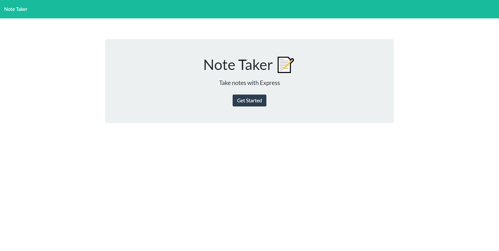
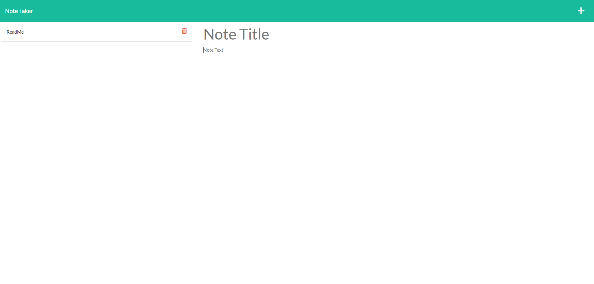

# NotesTaker

## Table of Contents
1. [Description](#description)
2. [Visuals](#visuals)
3. [Resources](#resources)

## Description
This application uses express and routes to create a functional note taking tool deployed through Heroku. It is a super useful app to use if you're multitasking and need to remember somthing, it will save your note even if you refresh the page. This app uses routes to be able to store your notes and delete them from the page and your json file.  

## Visuals

## Resources
- [Live Site](https://selaprivette.github.io//) 
- [Repository](https://github.com/selaprivette/NotesTaker)